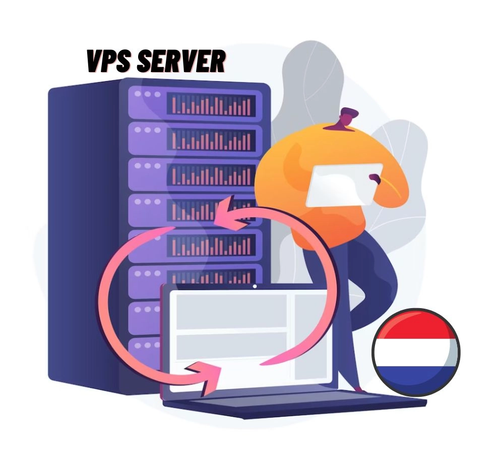
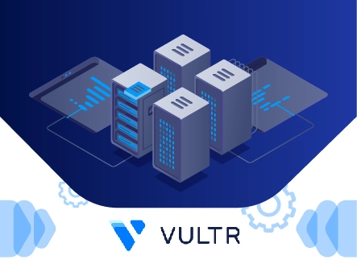

# Best VPS Hosting in the Netherlands for 2025: Your Complete Guide

Looking for a VPS host that won't break the bank while keeping your data safe? You're in the right spot. The Netherlands offers something special: privacy-friendly laws, lightning-fast connections to Europe and beyond, and DMCA-ignored hosting that lets you breathe easier.

Here's the thing—shared hosting feels cramped once your site grows. Dedicated servers? Way too pricey for most of us. VPS hosting hits that sweet spot: your own slice of server power without the hefty price tag.

---

## What Makes Netherlands VPS Hosting Different?

VPS hosting gives you a virtual private server—think of it as your own apartment in a larger building. You get dedicated resources (RAM, CPU, storage) that nobody else can touch, plus root access to customize everything.

But why the Netherlands specifically? 

The country sits at a major internet crossroads between Asia, Europe, and the Americas. That geography translates to fast loading times worldwide. Plus, Dutch data protection laws are robust, and many hosts there simply ignore DMCA takedown requests that plague US-based servers.

For anyone running content-heavy sites, international businesses, or just valuing privacy, Netherlands VPS hosting makes a lot of sense.

👉 **Want even more control and speed?** [Check out how cloud VPS can scale with your growing traffic](https://www.vultr.com/?ref=9738262-9J) and keep your site blazing fast no matter where visitors connect from.

## Top 9 Netherlands VPS Providers Worth Your Time

After testing dozens of hosts, here are the ones that actually deliver.

### 1. QloudHost – Best Overall for Privacy-Focused Hosting

QloudHost stands out for one big reason: they specialize in DMCA-ignored offshore hosting. Your site won't get yanked offline over frivolous complaints.

**What makes them special:**

- **Offshore protection**: Servers in the Netherlands where DMCA means nothing
- **No long-term contracts**: Cancel whenever you want, no questions asked
- **Free migration**: They'll move your site over without charging extra

They offer four VPS plans starting around basic configurations up to enterprise-level setups. Each includes full root access and your choice of Linux distributions.

**Best for**: Anyone who's tired of worrying about content takedowns or needs maximum privacy protection.

### 2. YouStable – Solid Performance Without the Premium Price

YouStable brings Indian hosting efficiency to European infrastructure. Their Netherlands VPS plans come fully managed, meaning you don't need to be a server expert.

**Key features:**

- **Free site migration**: Switch from your current host hassle-free
- **24/7 monitoring**: They watch your server and alert you to any issues
- **Let's Encrypt SSL**: Free security certificates included

Prices start low and scale with your needs. Their control panel makes server management surprisingly simple.

**Best for**: Small to medium businesses wanting managed VPS without the usual premium pricing.

### 3. Kamatera – Build Your Perfect Plan

Kamatera lets you customize everything. Pick exactly how much RAM, CPU cores, and storage you need. Pay only for what you use.

**What stands out:**

- **Total flexibility**: Create a plan that fits your exact requirements
- **Easy scaling**: Adjust resources up or down without lengthy migrations
- **Optional managed services**: Add management if you need it

Plans start around $4/month for basic configurations. You can choose hourly or monthly billing.

**Best for**: Tech-savvy users who know their requirements and want maximum control over costs.

### 4. TMDHosting – Fully Managed Premium Service

TMDHosting costs more than some competitors, but delivers white-glove service. Everything's handled for you.

**Premium features:**

- **Fully managed**: They handle all technical maintenance
- **Free CloudFlare CDN**: Boost your site speed globally
- **Multiple security layers**: BitNinja protection, firewalls, SSL certificates
- **Extensive knowledge base**: Learn as you go with their tutorials

Plans range from basic to enterprise level. Each includes the management overhead you'd normally pay extra for elsewhere.

**Best for**: Business sites where uptime and support matter more than saving a few bucks.

### 5. UltaHost – Budget-Friendly with Modern Features

UltaHost proves cheap doesn't mean lacking features. Starting under $6/month, you get solid performance.

**Notable features:**

- **Multiple control panels**: Choose cPanel, CyberPanel, Plesk, or Hestia
- **Unlimited bandwidth**: No caps on traffic
- **Staging environment**: Test changes before going live

Control panel choice affects pricing. Free panels (CyberPanel, Hestia) keep costs lowest. cPanel adds about $19/month.

**Best for**: Growing sites that need room to expand without hitting bandwidth limits.

### 6. ScalaHosting – Simple Setup with SPanel

ScalaHosting built their own control panel (SPanel) to simplify VPS management. It works surprisingly well.

**Key advantages:**

- **Offsite backups**: Your data stays safe even if the server fails
- **Unmetered bandwidth**: Grow without bandwidth charges
- **Custom SPanel interface**: Easier than cPanel for many tasks

Four build tiers range from $29.95 to $179.95 monthly. Each includes management and security essentials.

**Best for**: Beginners who want power without complexity, or anyone tired of cPanel's quirks.

### 7. LiquidWeb – Enterprise-Grade Infrastructure

LiquidWeb targets serious businesses with demanding requirements. Their Netherlands VPS includes enterprise features.

**Premium capabilities:**

- **DDoS protection**: Built-in security against attacks
- **Right-sized plans**: They help configure optimal CPU/RAM ratios
- **CloudFlare CDN**: Speed boost included
- **Easy scaling**: Upgrade with minimal downtime

Plans start higher than budget hosts but include features others charge extra for. 100% uptime guarantee backs their reliability claims.

**Best for**: Businesses that can't afford downtime and need guaranteed performance.

### 8. Cloudways – Multi-Provider Managed Platform

Cloudways doesn't own servers—they manage them across multiple cloud providers (DigitalOcean, AWS, Google Cloud). You get their management layer plus the provider's infrastructure.

**Unique features:**

- **Auto-healing**: Servers automatically recover from common issues
- **One-click SSL**: Free certificates installed instantly
- **Server cloning**: Duplicate setups with a click
- **Staging areas**: Test everything before deployment

Pricing varies by provider: DigitalOcean starts around $14/month, AWS and Google Cloud cost more.

**Best for**: Developers who want cloud power without cloud complexity.

### 9. Vultr – Veteran Provider with SSD Speed

Vultr's been around forever in internet terms. Their Netherlands location delivers fast SSD storage and reliable performance.

**Core features:**

- **SSD storage**: Fast read/write speeds
- **One-click apps**: Install popular software instantly

Plans start at $30/month for single vCPU configurations. Straightforward pricing with no surprises.

**Best for**: Anyone wanting a proven provider without fancy extras, just solid hosting basics done right.

## Why Netherlands VPS Makes Sense

**Speed matters**: The Netherlands sits at the intersection of major internet cables connecting continents. Your European visitors get blazing speeds, and even US and Asian traffic stays fast.

**Privacy protection**: Dutch laws protect data better than many countries. DMCA? Not applicable. Content restrictions? Far fewer than US hosting.

**Legal advantages**: The legal framework favors online businesses. Less worry about frivolous takedowns or overzealous copyright claims.

For international businesses, content creators, or anyone who values privacy, Netherlands hosting just works better.

---

## Final Thoughts

Here's the bottom line: Netherlands VPS hosting gives you power, privacy, and performance without breaking the bank. Whether you need DMCA-ignored hosting (QloudHost), enterprise features (LiquidWeb), or budget-friendly options (UltaHost, YouStable), there's a host on this list for you.

Most offer money-back guarantees, so you can test drive before committing. The worst that happens? You try another one.

Your site deserves better than cramped shared hosting. Give it room to breathe with a Netherlands VPS—your visitors will notice the difference.
